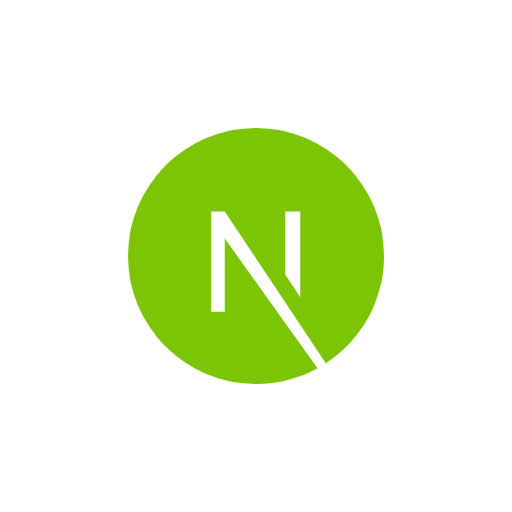

# :computer: Josue BYIRINGIRO [**`A FULL STACK WEB DEVELOPER`**]

Full Stack Developer with expertise in **`PERN/MERN`** development, I bring vast experience in crafting dynamic web applications using a diverse tech stack. My proficient in frontend design and front-end building, I have a strong command of  **`FIGMA DESIGN`** and  **`PHOTOSHOP`** as part of the design, including  **`HTML`**,  **`CSS`**,  **`JAVASCRIPT`**,  **`REACTJS/REDUX`**,  **`NEXTJS/TYPESCRIPT`**,  **`NODEJS/TYPESCRIPT`**, and various databases like   **`POSTGRESQL`**,  **`MYSQL`**,  **`MOMGO DB`**,  **`MICROSERVICES`**, and  **`DEVOPS ( Cloud Computing)`**,  **`AWS`** and  **`FIREBASE SERVICES`**,  **`NETLIFY`**,  **`HEROKU`**,  **`DIGITAL OCEAN`**, etc...

My proficiency also extends to Progressive Web App (PWA) development, where I've honed my abilities to create responsive and engaging web experiences that seamlessly function across different devices. Collaborating closely with cross-functional teams, I ensure the delivery of user-friendly, secure, and scalable solutions that meet clients' needs while adhering to software engineering best practices.

Furthermore, I possess a deep understanding of cloud technologies, particularly Heroku, AWS services, and Firebase, leveraging them to enhance application performance, scalability, and reliability, and contributing to the growth and success of the companies I work with, driven by a passion for continuous learning and collaboration.

  

      
      
      
      
   

# 🧰 LANGUAGES AND TOOLS

 
